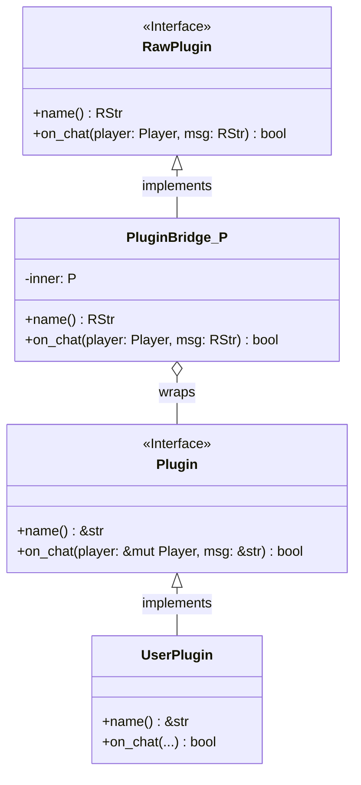
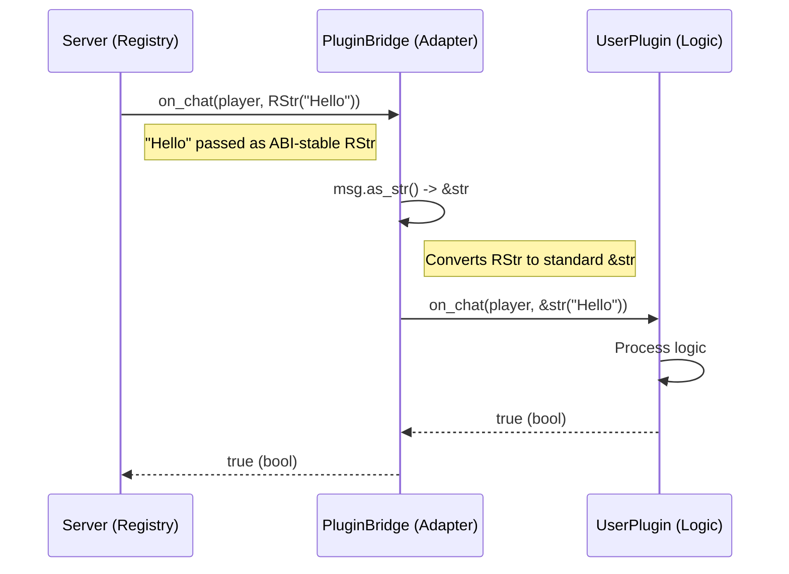
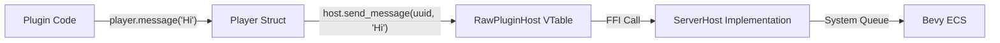

# Unastar Plugin Architecture

This document describes the architecture of the Unastar native plugin system, specifically focusing on how ABI stability is achieved while maintaining a clean, user-friendly API for plugin developers.

## High-Level Overview

The plugin system is designed to allow Rust plugins (compiled as dynamic libraries `.dll`/`.so`) to be loaded by the Unastar game server.

Key Goals:
1.  **ABI Stability**: Plugins compiled with different Rust compiler versions should work (mostly) through stable FFI boundaries.
2.  **Clean API**: Plugin developers should use standard Rust types (`&str`, `Vec`, `Option`), not FFI types (`RStr`, `RVec`, `ROption`).
3.  **Safety**: Minimizing generic pointer usage and ensuring safe memory handling across boundaries.

```mermaid
graph TD
    Server[Unastar Server] -->|Loads DLL| Loader[PluginLoader]
    Loader -->|Calls _create_plugin| PluginDLL[Plugin DLL]
    PluginDLL -->|Returns RawPlugin_TO| Server
    Server -->|Ticks| RawPlugin[RawPlugin (ABI stable)]
    RawPlugin -->|Bridge| UserPlugin[User Plugin (Clean API)]
    
    subgraph "Server Side"
    Server
    Loader
    Registry[PluginRegistry]
    end

    subgraph "ABI Boundary (unastar-api/native)"
    RawPlugin
    RawPluginHost
    end

    subgraph "Plugin Side"
    PluginDLL
    UserPlugin
    end
```

## The Bridge Pattern

To satisfy both ABI stability (which requires `abi_stable` types like `RStr`) and clean API (standard types like `&str`), we use a **Bridge Pattern**.

### Components

1.  **`RawPlugin` Trait (Internal)**:
    *   Marked with `#[sabi_trait]`.
    *   Uses FFI-safe types: `RStr`, `ROption<RString>`, etc.
    *   This is the actual *Object Safe* trait passed across the DLL boundary.

2.  **`Plugin` Trait (Public)**:
    *   Standard Rust trait.
    *   Uses user-friendly types: `&str`, `Option<String>`.
    *   Implemented by the developer.

3.  **`PluginBridge<P>` (Adapter)**:
    *   A struct that wraps the user's plugin `P`.
    *   Implements `RawPlugin`.
    *   Translates types between the two worlds.



### Data Flow Example: Chat Event

When a chat message arrives, the server (via `PluginRegistry`) invokes the plugin.



## Host Interaction

Plugins interact with the server through the `NativeGameContext` and `Player` wrappers.

1.  **`PluginHost` / `RawPluginHost`**: The Interface the server implements (VTable).
2.  **`NativeGameContext`**: A wrapper that holds the `RawPluginHost` trait object.
3.  **`Player`**: A wrapper around an Entity ID + `RawPluginHost`.

This allows plugins to call methods like `player.message("Hi")` without knowing internal server memory layout.



## Creating a Plugin

The developer only sees:

```rust
use unastar_api::native::*;

struct MyPlugin;

impl Plugin for MyPlugin {
    fn name(&self) -> &str { "MyPlugin" }
    fn on_chat(&mut self, player: &mut Player, message: &str) -> bool {
        // ... logic ...
        true
    }
}

// Export function wraps MyPlugin in PluginBridge automatically
#[no_mangle]
pub extern "C" fn _create_plugin() -> RawPlugin_TO<RBox<()>> {
    let bridge = PluginBridge(MyPlugin);
    RawPlugin_TO::from_value(bridge, TD_Opaque)
}
```
