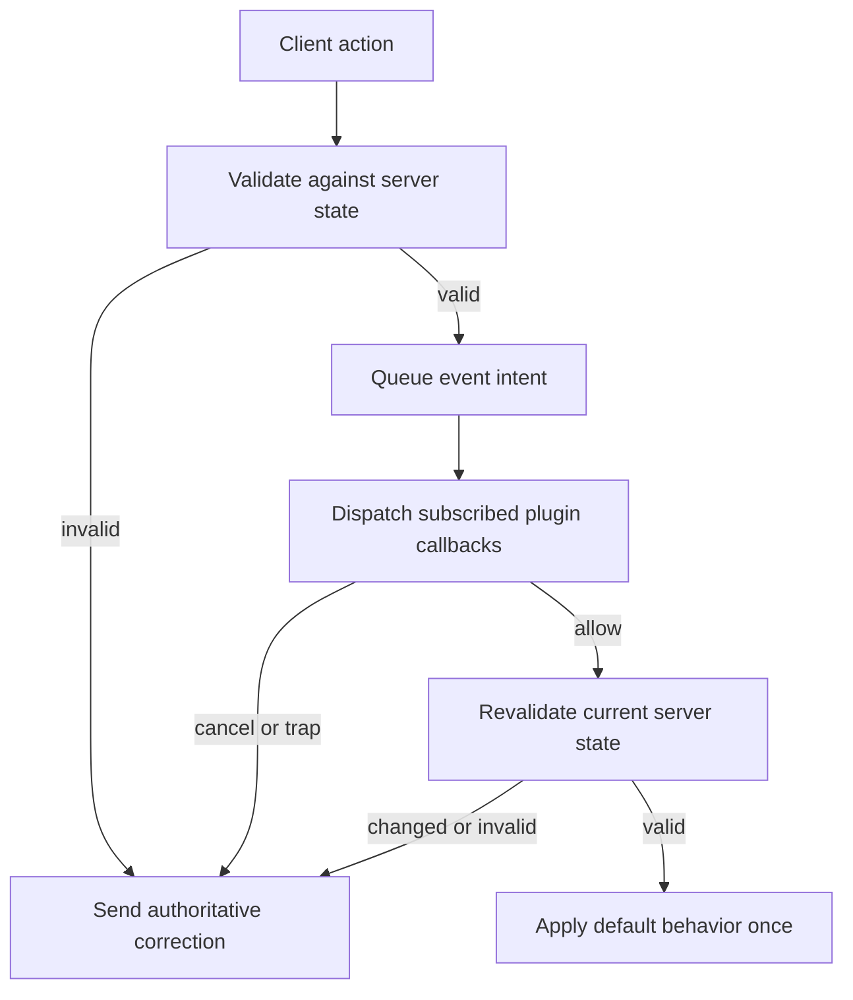

# Unastar Plugin Architecture

Unastar loads WebAssembly components with Wasmtime. Plugins implement the
[`unastar:plugin@0.3.0` WIT world](crates/unastar-api/wit/world.wit); Rust compiler
layout and native dynamic-library ABIs do not cross the host boundary.

## API and Registration

- `crates/unastar-api/wit` defines imported host interfaces, the player resource,
  shared records, and typed event exports.
- `unastar_api::Guest` is generated by `wit-bindgen` and requires every export.
- `unastar_api::Plugin` supplies default event implementations. Boolean callbacks
  return `true` to allow default behavior and `false` to cancel it.
- `#[unastar_api_macros::plugin]` registers a concrete `Plugin` implementation by
  invoking `unastar_api::export_plugin!`, which emits the complete `Guest` bridge.
  Use the attribute or the export macro, not both.

```rust
use unastar_api::{Player, Plugin};
use unastar_api_macros::plugin;

struct MyPlugin;

#[plugin]
impl Plugin for MyPlugin {
    fn on_player_chat(_player: &Player, message: String) -> bool {
        !message.contains("blocked")
    }
}
```

The obsolete native-plugin and event-handler attribute macros have been removed.
Event methods are ordinary typed `Plugin` methods; no serialized event dispatcher
or `GameContext` adapter is involved. The
[example plugin](crates/example-plugin) is the buildable consumer reference.

## Build and Installation

```text
rustup target add --toolchain nightly-2026-03-05 wasm32-wasip2
cargo build -p example_plugin --target wasm32-wasip2
```

Install each plugin in its own directory beneath the server working directory's
`plugins/`, with `plugin.toml` and `plugin.wasm`. For the example, use
`crates/example-plugin/plugin.toml` and
`target/wasm32-wasip2/debug/example_plugin.wasm`. Its manifest subscriptions select
which exported callbacks receive server events. The current WIT package version
is `0.3.0`; the manifest's `api_version` must match it. Older manifests are
rejected before the component is compiled or instantiated. Rebuild components
against the updated `unastar_api` crate to provide the new exports.

## Loading and Host Access

Startup discovery reads manifests and compiles components. Before the first
simulation tick, the runtime instantiates pending components and invokes `on-load`,
with the live ECS World attached for both operations: component start functions
can invoke hosts too.
A failed instantiation or `on-load` rejects that plugin.

`HostContext` scopes its raw World attachment to the synchronous Wasmtime call.
The attachment is cleared on return and unwind; callbacks cannot retain a World
reference. Host queries read current ECS state. Player mutation requests become
`PluginAction` entries in the ECS action queue, processed by the server's plugin
action system rather than exposing mutable ECS references to guests.

Player handles and their host entity mappings are scoped to a host invocation;
plugins should obtain and use handles during the current callback, not retain
them for subsequent callbacks.

## Player Lifecycle Callbacks

Subscribe to `player_damage`, `player_death`, `player_respawn` and
`player_respawned` in `plugin.toml` to receive synchronous lifecycle callbacks.
They use the same native hooks available to embedding applications.

- `on-player-damage` receives the incoming damage before difficulty, armour and
  the hurt timer. Return `some(amount)` to adjust it or `none` to cancel the hit
  before health, inventory, timers, food or packets change.
- `on-player-death` observes a committed death after ordinary drops and before an
  optional immediate respawn. Prevent lethal damage in `on-player-damage` when
  the death should not happen.
- `on-player-respawn` receives the proposed eye-height position. Return
  `some(position)` to choose the destination or `none` to keep the player dead
  without acknowledging the respawn request.
- `on-player-respawned` observes the committed position after the player is alive
  and its client updates have been sent.

Damage and death include a typed `damage-cause` and an optional borrowed attacker
handle. The handle is present only for a player attacker; other actors and
unattributed damage have no player handle. These handles have the same per-call
lifetime as other player resources.

The generated Rust `Plugin` defaults preserve the incoming damage and destination.
Invalid damage or positions and trapped decision callbacks cancel the operation.
Subscribers run in plugin-ID order; each receives the previous allowed decision,
and cancellation stops further component callbacks for that operation.
Committed notifications cannot undo the operation. Actions from a trapped
callback are discarded.

The runtime shares the manager with the native bridge through a mutex and never
holds it while running the simulation. Reentrant or contended access cancels a
pending damage or respawn decision immediately. It does not wait on its own lock.

Custom runtimes share their manager through `Arc<Mutex<PluginManager>>` and call
`PluginManager::attach_to_world(manager.clone(), world)` once to install the
lifecycle bridge. They call `PluginManager::begin_tick(world)` before simulation and
`PluginManager::tick(world)` afterward. The first call initializes pending
components and starts the instruction budget; lifecycle callbacks and buffered
callbacks consume that same budget. Repeating `begin_tick` before `tick` finishes
does not replenish it. Initialization has its own separate budget.
Renewing fuel does not recreate an instance invalidated by a component trap;
that instance continues to fail closed until it is reloaded.

## Resource Limits

Manifest `[limits]` supports:

| Key | Default | Enforcement |
| --- | --- | --- |
| `max_memory` | `67108864` bytes | `StoreLimits` caps each linear memory at creation and growth; exceeding it traps. |
| `fuel_per_tick` | `10000000` | One instruction budget shared by the plugin's subscribed event callbacks in a tick. |

Instantiation and `on-load` share a separate initialization fuel budget of the
same size. Event callbacks do not replenish one another's budget; the next tick
replenishes it. Epoch interruption remains an independent wall-clock guard,
with the deadline reset for each invocation. Traps are logged; cancellable
callbacks that trap fail closed.

Filesystem capability requests preopen only the plugin directory. Do not infer
that every declared manifest capability has an implemented host interface.

## Cancellable Gameplay


```mermaid
flowchart TD
    Input[Client action] --> Validate[Validate against server state]
    Validate -->|invalid| Correct[Send authoritative correction]
    Validate -->|valid| Queue[Queue event intent]
    Queue --> Dispatch[Dispatch subscribed plugin callbacks]
    Dispatch -->|cancel or trap| Correct
    Dispatch -->|allow| Check[Revalidate current server state]
    Check -->|changed or invalid| Correct
    Check -->|valid| Commit[Apply default behavior once]
```

Block breaks and placements mutate chunks only through the post-dispatch commit
hook. Survival placement consumes one selected server-owned item at commit;
cancellation consumes nothing. Cancelling the clicked-face interaction also
cancels its immediately paired placement intent. Multiple intents targeting the
same block are revalidated, so later intents cannot overwrite an occupied target
or replay a completed break.

Chat packet handling queues `PlayerChat` without broadcasting. The plugin
manager is the sole owner of the default chat broadcast, after all subscribed
callbacks have allowed it; cancellation suppresses that broadcast.

## Verification

```text
cargo test -p unastar -p unastar_api -p unastar_api_macros
cargo clippy -p unastar -p unastar_api -p unastar_api_macros --all-targets -- -D warnings
cargo build -p example_plugin --target wasm32-wasip2
```

Host regressions use real inline Wasm components and canonical resource handles,
so loading, cancellation, memory growth, and fuel exhaustion do not require an
installed cross-compilation target. The macro crate also compiles a consumer
that registers a typed plugin without serialization dependencies.
