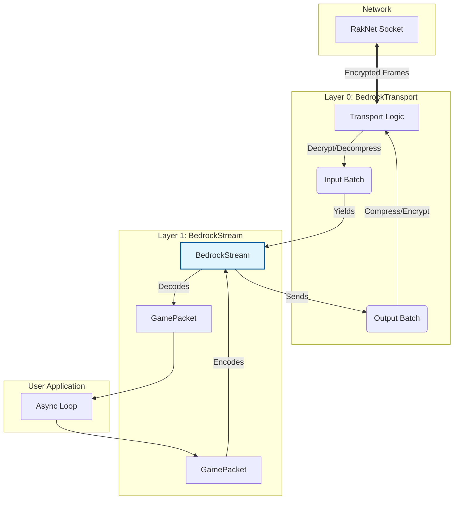

# Jolyne

[](https://crates.io/crates/jolyne)
[](https://docs.rs/jolyne)
[](https://github.com/axolotl-stack/jolyne/blob/main/LICENSE)

**Jolyne** is a robust, low-level Minecraft: Bedrock Edition protocol library for Rust. It provides the core primitives for building high-performance servers, clients, proxies, and analysis tools.

> **Note:** Server implementation logic (world, entities, ticking) is handled by the `unastar` crate. Jolyne focuses strictly on the protocol implementation.

## Architecture

Jolyne adopts a layered architecture to provide flexibility without sacrificing type safety.



### Components

#### Layer 0: `BedrockTransport`
The "pipe" layer. It handles the gritty details of the protocol:
- **Encryption:** AES-256-GCM (managed transparently).
- **Compression:** Zlib/Snappy support.
- **Batching:** Decodes raw frames into batches of packets.
- **IO:** Implements `Stream` and `Sink` for raw `Batch` objects.

#### Layer 1: `BedrockStream<S, R>`
The "state" layer. A strongly-typed wrapper around the transport that enforces protocol correctness.
- **Generics:**
  - `S: State` - The current handshake state (`Handshake`, `Play`).
  - `R: Role` - The connection role (`Client`, `Server`).
- **Safety:** You cannot send gameplay packets while in the handshake state. The compiler prevents it.
- **Usage:**
  ```rust,ignore
  // Example: Server Accepting a Connection
  let mut listener = BedrockListener::bind("0.0.0.0:19132").await?;
  
  while let Some(handshake_stream) = listener.accept().await {
      // handshake_stream is type: BedrockStream<Handshake, Server>
      
      // Perform handshake (consumes the old stream, returns a new one)
      let mut play_stream = handshake_stream.login().await?;
      
      // Now you can handle game packets
      while let Ok(packet) = play_stream.recv_packet().await {
          // ...
      }
  }
  ```

## Features

- **Strict State Machine:** Typestate pattern prevents invalid protocol transitions.
- **Zero-Copy Networking:** Uses `bytes::Bytes` for efficient packet handling.
- **Modular:** Feature flags (`client`, `server`, `encryption`) let you compile only what you need.
- **Async First:** Built on `tokio` for high concurrency.

## Usage

Add this to your `Cargo.toml`:

```toml
[dependencies]
jolyne = "0.1"
```

### Example: Simple Bot (Client)

```rust,no_run
use jolyne::stream::client::ClientHandshakeConfig;
use jolyne::stream::BedrockStream;
use jolyne::protocol::{McpePacket, PacketRequestChunkRadius};

#[tokio::main]
async fn main() -> Result<(), Box<dyn std::error::Error>> {
    let addr = "127.0.0.1:19132".parse()?;

    // 1. Connect
    let handshake = BedrockStream::connect(addr).await?;
    
    // 2. Configure (Auto-generate keys/uuid)
    let config = ClientHandshakeConfig::random(addr, "JolyneBot");

    // 3. Join (Handles auth, encryption, resource packs)
    let mut client = handshake.join(config).await?;
    
    // Send a chunk radius request (could be anything.)
    let req = PacketRequestChunkRadius {
        chunk_radius: 8,
        max_radius: 8,
    };
    client.send_packet(McpePacket::from(req)).await?;
    
    Ok(())
}
```

## 🔮 Future Roadmap

### Transport Decoupling (Completed)
`BedrockTransport` is now agnostic. `jolyne` supports `NetherNet` (via `tokio-nethernet`), and `Raknet` (via `tokio-raknet`).
- **Status**: ✅ Done. Users can bring their own transport implementation.

### API Stabilization
- **Goal**: stabilize the `BedrockStream` API to minimize breaking changes.
- **Goal**: Improve ergonomics for custom packet handling and batching strategies.
