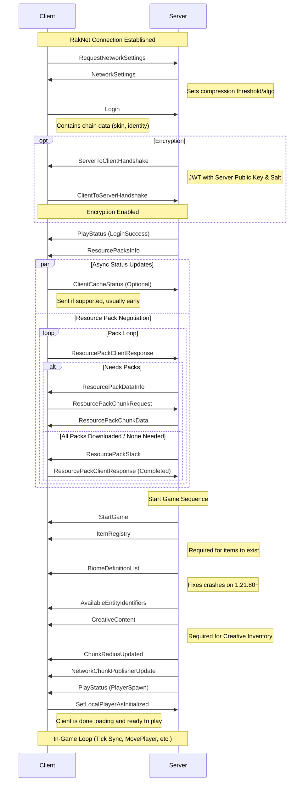

# Bedrock Edition Login Sequence

This document outlines the protocol sequence for a client connecting to a Bedrock Dedicated Server (BDS).

## Implementation Details

### 1. Handshake Phase
- **NetworkSettings**: Negotiates compression.
- **Login**: Validates the XBOX Live chain (if online mode) and client identity.
- **Encryption**: ECDH key exchange using P-384 curves.

### 2. Resource Pack Phase
- Even if no packs are required, the server must send `ResourcePacksInfo`.
- The client must respond with `Completed` (after receiving `ResourcePackStack`) before `StartGame` is sent.
- **ClientCacheStatus**: Clients may send this to indicate blob cache support. It should be handled (usually ignored if cache not implemented) without blocking the flow.

### 3. Spawn Sequence
- `StartGame`: Contains world settings, basic level info, and player position.
- `ItemRegistry`: Defines all custom and vanilla items for the session.
- `BiomeDefinitionList`: **CRITICAL** for newer clients.
- `CreativeContent`: Populates the creative inventory.
- `PlayStatus(PlayerSpawn)`: Tells the client to remove the loading screen.
- `SetLocalPlayerAsInitialized`: Sent by the **Client** to confirm they are ready.